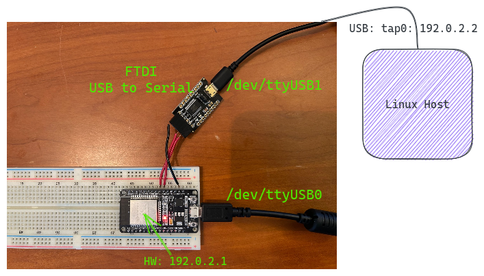

# tuntap tool

This tool provides network interface over a standard serial device. This was
written to test Ethernet over serial interfaces using hardware running the
Zephyr RTOS.

Currently, this interface uses the Consistent Overhead Byte Stuffing (COBS)
framing on the serial interface (using \x00 as the frame delimeter).  Hardware
connected must also support this for this to work.

## Getting started

Clone:
```
git clone https://github.com/cweave72/tuntap-serial.git
```

Run uv:
```bash
cd tuntap
uv sync
```

## Running the tool

Usage:
```
source .venv/bin/activate
(tuntap-demo) sudo .venv/bin/taptool --help
Usage: taptool [OPTIONS] COMMAND [ARGS]...

  CLI receiving raw ethernet frames from tuntap interface.

Options:
  --loglevel TEXT  Debug logging level.
  --logtree        Show logging tree and exit.
  -d, --debug      Shortcut for --loglevel=debug.
  -h, --help       Show this message and exit.

Commands:
  tap   Implements tap device over serial.
  test  Tests tty data.
```

Assumptions:
Serial device to hardware: `/dev/ttyUSB1`
IP address to set on the TAP interface: 192.0.2.2
Note: Hardware device must be on the 192.0.2.0/24 network

Run:
```
(tuntap-demo) sudo .venv/bin/taptool -d tap --tty /dev/ttyUSB1 --ip 192.0.2.2
```

Note we need to run the tool as root since we are using the pytun package.

Verify the interface is up:
```
$ ip addr show tap0
143: tap0: <BROADCAST,MULTICAST,UP,LOWER_UP> mtu 1500 qdisc fq_codel state UNKNOWN group default qlen 1000
    link/ether 92:67:a2:90:c1:10 brd ff:ff:ff:ff:ff:ff
    inet 192.0.2.2/24 brd 192.0.2.255 scope global tap0
       valid_lft forever preferred_lft forever
    inet 169.254.214.81/16 brd 169.254.255.255 scope global noprefixroute tap0
       valid_lft forever preferred_lft forever
    inet6 fe80::5310:16ef:6c45:12c8/64 scope link 
       valid_lft forever preferred_lft forever
```

You should now be able to communicate to a hardware device connected:




## Notes on manually creating the TAP device

Creating a tuntap device:
```
sudo ip tuntap add mode tap tap0
```

Bring it up:
```
sudo ip link set dev tap0 up
```

Assign IP (example addr shown):
```
sudo ip addr add 192.168.40.1/24 dev tap0
```

Note: This might bring down your internet connection if your DNS is set to your
local gateway (error is DNS_PROBE_FINISHED_BAD_CONFIG). Fix by adding
nameservers to /etc/netplan (1.1.1.1, 1.0.0.1)

Removing the tap interface:
```
sudo tuntap del dev tap0
```
